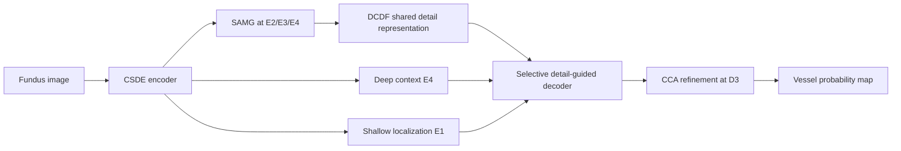

# CGDD-Net: Context-Guided Dynamic Detail Modeling for Retinal Vessel Segmentation

<div align="center">

**Official PyTorch implementation of CGDD-Net**

<p>
  <a href="https://github.com/lixincheng-xcl">Xincheng Li</a><sup>1</sup>,
  <a href="https://github.com/zhangxinyu-xyz">Xinyu Zhang</a><sup>1</sup>,
  Xiaoqi Sheng<sup>2</sup>
</p>

<p>
  <sup>1</sup>School of Computer Science, The University of Auckland, New Zealand<br>
  <sup>2</sup>School of Future Technology, South China University of Technology, China
</p>

<p>
  <a href="https://github.com/lixincheng-xcl/CGDD-Net"></a>
  <a href="https://www.python.org/"></a>
  <a href="https://pytorch.org/"></a>
  <a href="LICENSE"></a>
</p>

</div>

> **CGDD-Net** is a compact retinal vessel segmentation network that coordinates **where to sample**, **which spatial scale to use**, **which intermediate details to retain**, and **how those details are reused during reconstruction**.

---

## 📖 Table of Contents

- [🔥 News](#-news)
- [🧠 Method Overview](#-method-overview)
- [📊 Manuscript Results](#-manuscript-results)
- [🗂️ Repository Structure](#️-repository-structure)
- [🚀 Getting Started](#-getting-started)
- [🩻 Data Preparation](#-data-preparation)
- [🏃 Training and Evaluation](#-training-and-evaluation)
- [🧪 Ablation and Repeated Runs](#-ablation-and-repeated-runs)
- [🔁 Cross-Dataset Evaluation](#-cross-dataset-evaluation)
- [⚙️ Complexity and Verification](#️-complexity-and-verification)
- [🤝 Citation](#-citation)
- [🙏 Acknowledgements](#-acknowledgements)
- [📄 License](#-license)

---

## 🔥 News

- **2026-09-07** — Initial public release of the cleaned CGDD-Net training, evaluation, ablation, and profiling code.
- **2026-09-07** — Added reproducibility-oriented configuration, manifest-based dataset loading, and smoke tests.

---

## 🧠 Method Overview

Retinal vessels exhibit tortuous branching geometry, large caliber variation, and weak peripheral structures. CGDD-Net addresses these challenges with three coordinated stages:

1. **Geometry-adaptive encoding — CSDE**  
   The **Context-Guided Scale-Adaptive Deformable Encoding (CSDE)** module combines a stable fixed-grid branch with scale-adaptive deformable local attention. This lets the encoder adapt its sampling geometry without discarding reliable local evidence.

2. **Dynamic detail modeling — SAMG + DCDF**  
   **Spatially Adaptive Multi-Kernel Gating (SAMG)** assigns location-dependent weights to multi-kernel responses. **Dynamic Cross-Scale Detail Fusion (DCDF)** then aligns and consolidates selected detail responses from multiple encoder depths into a shared representation.

3. **Selective reconstruction**  
   The shared detail representation is reused across multiple decoder stages. Selective skip connections retain shallow localization and deep structural context, while a single Criss-Cross Attention (CCA) block provides lightweight contextual refinement.



The executable model definition is in [`cgddnet/models/cgddnet.py`](cgddnet/models/cgddnet.py), with CSDE, SAMG, DCDF and CCA blocks in [`cgddnet/models/blocks.py`](cgddnet/models/blocks.py).

The implementation exposes the same seven cumulative configurations used by the manuscript ablation:

| CLI value | Configuration |
|---|---|
| `baseline` | CBR U-shaped baseline with standard skips |
| `csde` | `baseline` + CSDE |
| `samg` | `csde` + SAMG |
| `dcdf` | `samg` + DCDF |
| `detail_decoder` | `dcdf` + multi-stage detail-guided decoding |
| `selective_skip` | `detail_decoder` + selective skips |
| `full` | `selective_skip` + CCA (complete CGDD-Net) |

All variants are cumulative from top to bottom.

---

## 📊 Manuscript Results

The current manuscript reports the following ROC-AUC values:

| Dataset | DRIVE | CHASE_DB1 | STARE | HRF |
|---|---:|---:|---:|---:|
| **CGDD-Net AUC** | **0.9861** | **0.9910** | **0.9942** | **0.9871** |

The default full model in this release contains **2,970,278 trainable parameters (2.97 M)**.

> **Reproducibility note:** dataset files, trained checkpoints, and run-level prediction artifacts are not redistributed in this repository. The code is designed to reproduce training and evaluation once the public datasets and fixed split manifests are prepared. See [`docs/REPRODUCIBILITY.md`](docs/REPRODUCIBILITY.md).

---

## 🗂️ Repository Structure

```text
CGDD-Net/
├── cgddnet/
│   ├── models/              # CGDD-Net, CSDE, SAMG, DCDF, CCA
│   ├── data/                # preprocessing and dataset loaders
│   └── utils/               # metrics, inference, configs, reproducibility
├── configs/
│   └── default.yaml         # default paper-oriented configuration
├── splits/                  # train/val/test JSON manifest templates
├── scripts/                 # training, ablation, repeat-run helpers
├── tools/                   # manifest, profiling, repeat-summary utilities
├── tests/                   # architecture smoke tests
├── examples/
│   └── quickstart.py
├── docs/
│   ├── DATASETS.md
│   ├── REPRODUCIBILITY.md
│   └── ARCHITECTURE.md
├── train.py
├── test.py
├── cross_dataset.py
├── requirements.txt
├── environment.yml
├── pyproject.toml
└── LICENSE
```

---

## 🚀 Getting Started

### 1. Clone the repository

```bash
git clone https://github.com/lixincheng-xcl/CGDD-Net.git
cd CGDD-Net
```

### 2. Create the environment

Conda:

```bash
conda env create -f environment.yml
conda activate cgddnet
```

or pip:

```bash
python -m venv .venv
source .venv/bin/activate
pip install -U pip
pip install -r requirements.txt
pip install -e .
```

The deformable local-attention path uses native PyTorch `grid_sample`; no custom CUDA deformable-convolution extension is required.

### 3. Quick architecture check

```bash
pytest -q
```

or:

```bash
python examples/quickstart.py
```

Expected output shape:

```text
input : (1, 3, 48, 48)
output: (1, 1, 48, 48)
params: 2,970,278
```

---

## 🩻 Data Preparation

CGDD-Net supports **DRIVE**, **CHASE_DB1**, **STARE**, and **HRF** through JSON manifests. Dataset files are not included; please obtain them from their official providers and respect the corresponding licenses.

A sample manifest entry is:

```json
[
  {
    "id": "sample_001",
    "image": "images/sample_001.png",
    "mask": "masks/sample_001.png",
    "fov": "fov/sample_001.png"
  }
]
```

`fov` is optional. If it is absent, the code estimates a conservative field-of-view mask from the fundus image.

Update dataset roots in `configs/default.yaml`, then populate:

```text
splits/
├── DRIVE/{train,val,test}.json
├── CHASE_DB1/{train,val,test}.json
├── STARE/{train,val,test}.json
└── HRF/{train,val,test}.json
```

A helper is provided for pairing image/mask directories:

```bash
python tools/manifest_from_dirs.py \
  --root data/DRIVE \
  --images training/images \
  --masks training/1st_manual \
  --fovs training/mask \
  --output splits/DRIVE/train_all.json
```

For detailed guidance, see [`docs/DATASETS.md`](docs/DATASETS.md).

### Default preprocessing

- RGB fundus image → grayscale
- FOV-aware standardization
- CLAHE (`clipLimit=2.0`, `8×8` tiles)
- gamma correction (`γ=1.2`)
- normalization and replication to three channels
- random `48×48` crops sampled from `64×64` in-FOV windows
- paired horizontal/vertical flips and right-angle rotations

---

## 🏃 Training and Evaluation

### Train CGDD-Net

```bash
python train.py \
  --config configs/default.yaml \
  --dataset DRIVE \
  --ablation full \
  --seed 2026 \
  --output runs/DRIVE/full/seed_2026
```

Default optimization:

- Adam
- initial learning rate `5e-4`
- batch size `64`
- cosine annealing
- up to `50` epochs
- early stopping patience `6`
- BCE-with-logits objective
- best checkpoint selected by validation AUC

### Test

```bash
python test.py \
  --config configs/default.yaml \
  --dataset DRIVE \
  --checkpoint runs/DRIVE/full/seed_2026/best.pt \
  --save-predictions
```

Evaluation uses overlapping `96×96` windows with stride `16`, probability averaging, and a default threshold of `0.5`.

The evaluator writes:

```text
summary.json
per_image.csv
predictions/*.png    # when --save-predictions is used
```

Reported metrics are **SE, SP, ACC, F1, and AUC**.

---

## 🧪 Ablation and Repeated Runs

### Seven-step cumulative ablation

```bash
bash scripts/run_ablation.sh DRIVE configs/default.yaml 2026
```

Supported variants:

```text
baseline → csde → samg → dcdf → detail_decoder → selective_skip → full
```

### Repeated runs

```bash
bash scripts/run_repeats.sh DRIVE configs/default.yaml
python tools/summarize_repeats.py runs/DRIVE/full
```

The helper script uses seeds `2026` through `2035` by default.

---

## 🔁 Cross-Dataset Evaluation

Train on the source dataset and evaluate the selected source-domain checkpoint on the target dataset without target-domain fine-tuning:

```bash
python cross_dataset.py \
  --config configs/default.yaml \
  --source STARE \
  --target DRIVE \
  --checkpoint runs/STARE/full/seed_2026/best.pt
```

---

## ⚙️ Complexity and Verification

Profile the model:

```bash
python tools/profile_model.py --ablation full --size 256
```

The profiler reports trainable parameters and the `fvcore` counted-FLOP proxy. Unsupported operators are printed explicitly and should not be interpreted as hardware latency.

The release package has been smoke-tested:

- all seven ablation variants produce finite `B×1×H×W` logits;
- the full model contains **2,970,278** trainable parameters;
- forward and BCE backward passes produce finite values;
- `pytest -q` passes the included tests.

See [`VERIFICATION.md`](VERIFICATION.md) and [`docs/REPRODUCIBILITY.md`](docs/REPRODUCIBILITY.md).

---

## 🤝 Citation

If you find this code useful, please cite the CGDD-Net manuscript:

```bibtex
@misc{li2026cgddnet,
  title   = {CGDD-Net: Context-Guided Dynamic Detail Modeling for Retinal Vessel Segmentation},
  author  = {Li, Xincheng and Zhang, Xinyu and Sheng, Xiaoqi},
  year    = {2026},
  note    = {Manuscript}
}
```

The citation will be updated when final publication metadata becomes available.

---

## 🙏 Acknowledgements

This release was informed by the open-source retinal vessel segmentation ecosystem. In particular, we thank the authors of:

- [MDF-Net](https://github.com/virtual11111/MDF-Net)
- [VesselSeg-Pytorch](https://github.com/lee-zq/VesselSeg-Pytorch)

for making reusable training and evaluation references publicly available.

The CGDD-Net architecture and the release implementation in this repository are organized as a standalone package.

---

## 📄 License

This project is released under the [MIT License](LICENSE).

For the public retinal datasets used by the project, please follow the licenses and terms of their original providers.
