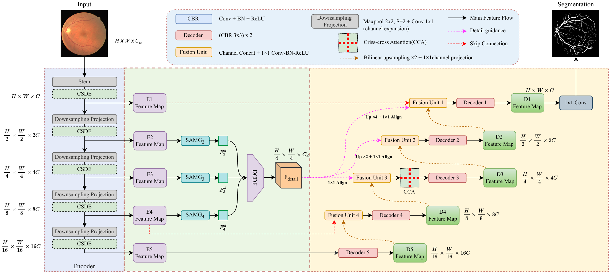

# CGDD-Net

**Context-Guided Dynamic Detail Modeling for Retinal Vessel Segmentation**

Authors: **Xincheng Li, Xinyu Zhang, Xiaoqi Sheng**.

School of Computer Science, The University of Auckland, New Zealand; School of Future Technology, South China University of Technology, China.

This repository provides the PyTorch implementation of the CGDD-Net architecture described in the manuscript. It includes Context-Guided Scale-Adaptive Deformable Encoding (CSDE), Spatially Adaptive Multi-Kernel Gating (SAMG), Dynamic Cross-Scale Detail Fusion (DCDF), detail-guided decoding, selective skip connections, and one criss-cross attention block at the D3 fusion stage.

[中文说明](README_zh.md) · [Architecture](docs/architecture.md) · [Data protocol](docs/data_protocol.md) · [Release status](docs/release_status.md)



## Manuscript-aligned implementation

The default model uses one grayscale input channel, encoder widths **8, 16, 32, 64, 128**, and an eight-channel shared detail representation. The full model contains **1,956,802 trainable parameters (1.96 M)**. The base learning rate is **0.001**.

The implementation follows the current manuscript design choices:

- CSDE uses four equal-width attention heads with base spacings `(1, 3, 5, 7)` and nine sampling points per head.
- Each head predicts nine 2-D offsets through a zero-initialized `3x3` convolution. The query uses the center-point offset; keys and values use all nine locations.
- Sampling uses bilinear interpolation, border padding, and `align_corners=False`.
- SAMG uses dense `1x1`, `3x3`, `5x5`, and `7x7` CBR branches with global-local adaptive gating.
- DCDF aligns the E2/E3/E4 detail features to the E3 resolution and projects them to the shared detail width.
- The shared detail representation is reused at D3, D2, and D1. Direct encoder skips are retained at E4 and E1.
- Main-path down/up channel projections use `1x1 Conv-BN-ReLU`; the prediction head is a bare `1x1` convolution producing logits.
- A single CCA block is applied after the D3 fusion unit.

The seven cumulative ablations are:

`baseline -> csde -> samg -> dcdf -> detail_decoder -> selective_skip -> full`

## Installation

Python 3.10 or newer is recommended. Install a suitable PyTorch build using the [official installation selector](https://pytorch.org/get-started/locally/), then:

```bash
python -m pip install -e '.[dev]'
python -m pytest -q
python scripts/smoke_test.py
```

The author-reported experimental environment is NVIDIA H200 141 GB, PyTorch 2.13.0, and CUDA 13.2. The repository CI and smoke tests are functional checks and do not replace the retinal benchmark experiments reported in the manuscript.

## Data preparation

Obtain DRIVE, STARE, CHASE_DB1, and HRF from their original providers and keep the image data outside the repository. Dataset manifests specify image, label, optional FOV, case ID, and dataset identity. Split validation checks image IDs, original identities, subject identities where available, file paths, and duplicate image content before patch sampling.

```bash
python scripts/prepare_data.py inspect --data-root ../datasets
```

For a new DRIVE experiment, for example:

```bash
python scripts/prepare_data.py generate --data-root ../datasets \
  --dataset DRIVE --strategy drive-official --seed 42 --output splits/new_drive
python scripts/prepare_data.py validate --data-root ../datasets \
  --train splits/new_drive/train.json --val splits/new_drive/val.json \
  --test splits/new_drive/test.json
```

Newly generated protocols are labelled as new experiments and are not presented as historical manuscript split manifests.

## Training and evaluation

```bash
python train.py --config configs/default.json \
  --train-manifest splits/new_drive/train.json \
  --val-manifest splits/new_drive/val.json \
  --data-root ../datasets \
  --output runs/drive_seed42 \
  --device cuda

python evaluate.py \
  --checkpoint runs/drive_seed42/best.pt \
  --manifest splits/new_drive/test.json \
  --data-root ../datasets \
  --output runs/drive_seed42/test \
  --device cuda
```

The reference configuration uses Adam, base learning rate `0.001`, batch size `64`, at most `50` epochs, `64x64` training patches, `150000` sampled patches per epoch, and zero weight decay. Linear warmup is followed by cosine cycles with restarts. Model selection uses mean validation AUC with early stopping.

Inference uses overlapping `96x96` patches with stride `16`. Each patch output is converted from logits to probabilities with sigmoid; overlapping probabilities are averaged before applying the default threshold `0.5`.

Metrics are computed inside each image's FOV and then averaged without pixel-count weighting. The evaluator exports per-image metrics and probability maps when requested.

## Loss function

Training minimizes FOV-masked binary cross entropy from logits:

```python
loss = (
    F.binary_cross_entropy_with_logits(logits, target, reduction="none") * fov
).sum() / fov.sum()
```

Only pixels inside the FOV contribute. There are no additional Dice, boundary, topology, class-reweighting, or deep-supervision loss terms.

## Reported manuscript results

| Dataset | SE | SP | ACC | F1 | AUC |
|---|---:|---:|---:|---:|---:|
| DRIVE | 0.8421 | 0.9768 | 0.9704 | 0.8323 | 0.9824 |
| CHASE_DB1 | 0.8600 | 0.9815 | 0.9752 | 0.8102 | 0.9938 |
| STARE | 0.8661 | 0.9812 | 0.9775 | 0.8510 | 0.9895 |
| HRF | 0.8362 | 0.9823 | 0.9711 | 0.8157 | 0.9874 |

Machine-readable transcriptions of the manuscript's main, ablation, and cross-dataset tables are stored under `results/`. They mirror the manuscript values and are kept separate from locally generated evaluation outputs.

## Profiling and statistics

```bash
python scripts/profile_model.py --config configs/default.json --height 96 --width 96
```

`docs/profile_measured.json` records the measured **1,956,802** trainable parameters and partial supported-operation estimates for the current implementation. These partial operator counts are not presented as a complete FLOP or hardware-latency claim in the manuscript.

For future repeated-run analyses:

```bash
python scripts/summarize_runs.py completed_runs.csv \
  --reference CGDD-Net --output statistics.json
```

The statistics utility operates on actual seed-level run records. The current manuscript Table 7 is a descriptive AUC comparison and is not derived from this prospective utility.

## Reproducibility records

A training run stores its resolved configuration, environment metadata, copied manifests and hashes, history, best/latest checkpoints, and training summary. Evaluation can export per-image metrics, probabilities, binary predictions, and provenance. This makes newly executed experiments traceable to a fixed configuration and dataset manifest.

## Publishing and attribution

The software is distributed under the repository license; dataset access and redistribution remain governed by the original dataset providers. Upstream workflow attribution is recorded in `NOTICE` and the corresponding license material is retained under `LICENSES/`.

The manuscript citation metadata will be updated when final publication information becomes available; no journal acceptance or DOI is asserted here.
